# Lesson 07: Using GeoJSON data

## Goals

You will learn how to deploy GeoJSON data and create a thematic map using Leaflet.

## Table of Contents

<!-- TOC -->

- [Lesson 07: Using GeoJSON data](#lesson-07-using-geojson-data)
    - [Goals](#goals)
    - [Table of Contents](#table-of-contents)
    - [Overview](#overview)
    - [What is GeoJSON?](#what-is-geojson)
    - [Part I. Creating GeoJSON data with geojson.io](#part-i-creating-geojson-data-with-geojsonio)
        - [Leaflet's GeoJson Layer](#leaflets-geojson-layer)
        - [Adding points to a map using L.geoJson](#adding-points-to-a-map-using-lgeojson)
            - [Using the pointToLayer option for L.GeoJson](#using-the-pointtolayer-option-for-lgeojson)
            - [Using L.geoJson to access properties data](#using-lgeojson-to-access-properties-data)
    - [Part II. Storing and loading GeoJSON data as an external file](#part-ii-storing-and-loading-geojson-data-as-an-external-file)
        - [Loading an external file .JS file with GeoJSON into our JavaScript](#loading-an-external-file-js-file-with-geojson-into-our-javascript)
        - [Drawing our GeoJSON data to the map](#drawing-our-geojson-data-to-the-map)
        - [Filtering GeoJSON Features](#filtering-geojson-features)

<!-- /TOC -->

## Overview

Within this lesson, we sharpen our understanding of the GeoJSON specification and how we encode data within it. We will use the web tool at [http://geojson.io/](http://geojson.io/) to create and display GeoJSON data, and then we'll use this GeoJSON-encoded data within Leaflet to draw new data layers. To better understand how to use GeoJSON in Leaflet, we go into more depth exploring the Leaflet options and methods available to a Leaflet GeoJson layer.

This week's [lab assignment](lab-07/) will offer you a guided tutorial on storing GeoJSON data in an external file, loading it into the script, and representing those data thematically with Leaflet.

## What is GeoJSON?

GeoJSON and the [The GeoJSON Format Specification](http://geojson.org/) is a now widely embraced open interchange format used for encoding geographic data (i.e., points, lines, polygons). It has recently replaced such data formats as KML (Keyhole Markup Language, pioneered within Google Earth) and ESRI's Shapefile format for representing spatial data, particularly on the web. Today it is the *de facto* standard used within such mapping libraries as Mapbox.js, Leaflet.js, CARTO, and Data Driven Documents (D3.js). In short, GeoJSON is a convenient way to store your spatial data and load it into a web map.

There's nothing particularly special about GeoJSON that demarcates it from the JavaScript Object Notation (JSON) on which preceded it, and with which you are already familiar. Concerning its structured syntax, it's simply another (nested) JavaScript object (although the specification does require that the **key names of properties are encoded within quotations**). 

What makes it "Geo"JSON (and useful for maps) is that specific key values use a standardized way of encoding and referencing simple geographic features.  In these cases the value of its type member is encoded as one of the following: `"Point"`, `"MultiPoint"`, `"LineString"`, `"MultiLineString"`, `"Polygon"`, `"MultiPolygon"`, `"GeometryCollection"`, `"FeatureCollection"`. This specification for Geometry objects is nothing new, having been established by the Open Geospatial Consortium (OGC) and International Organization for Standardization (ISO) since before we were putting maps on the web.

GeoJSON objects therefore always contain a key name of `"type"`, usually designating whether it is a `"FeatureCollection"` or a simple `"Feature"` (`"Feature"` members are generally collected within a `"FeatureCollection"` object). The member type and its coordinates are encoded within a `"geometry"` object. A `"properties"` object is typically reserved for encoding attribute data associated with the feature such a name.

```javascript
{
  "type": "Feature",
  "geometry": {
    "type": "Point",
    "coordinates": [125.6, 10.1]
  },
  "properties": {
    "name": "Dinagat Islands"
  }
}
```

A final important thing to remember about the GeoJSON specification is that the **coordinates are encoded as `[longitude, latitude]`.** That's different from how we usually say it ("latitude/longitude") but makes sense when you remember that longitude represents the *x* coordinate and latitude the *y* coordinate.

## Part I. Creating GeoJSON data with geojson.io

Writing our GeoJSON structures by hand would be extremely laborious, especially when there are plenty of other tools for the job. One common way to create GeoJSON is to use a desktop GIS such as QGIS (and as you learned in MAP671, Q will export any vector layer as GeoJSON while controlling for coordinate precision and number of fields to include). This is useful if you're working with existing geometry data.

For now, we're going to use a useful web-based tool for this learning how Leaflet handles GeoJSON. You can use [geojson.io](http://geojson.io/) to upload data in formats such as KML, GeoJSON, or CSV (provided there are lat and lon data columns provided) and then modify the geometries and attributes, convert formats, download files, or share them across the web. We're going to use this tool to draw and create some GeoJSON-formatted data. We'll then paste that code into the script we're using to build our Leaflet web maps.

First go to the site ([http://geojson.io/](http://geojson.io/)). While you can use the site without logging in, note that you can log in to the site using your GitHub credentials. The tool is then linked to your GitHub account and allows you to save maps you're creating with geojson.io as GitHub repositories, or [GitHub Gists](https://gist.github.com/), which are like small GitHub repositories used for storing code examples. So go ahead and log in.

The site interface is composed of, on the left side, a Leaflet map used for drawing various geometries on the map, including polylines, polygons, rectangles and point markers. On the right side is a window that displays the GeoJSON markup as you add features to the map. The tool is helpful in that it correctly formats the GeoJSON structure, as well as allows you to enter properties for each feature.

For the purpose of this demonstration, we're going to put markers on some cities within Estonia.  Since we're already familiar with Leaflet markers, let start with those. I'll begin by placing a few markers on the geojson.io map using the marker button (on the toolbar on the right side of the map, hover your mouse over each to see what they do). For this example, I'm going to zoom to Estonia and place a marker on four of the largest cities: Tallinn, Haapsalu, Parnu, and Tartu.

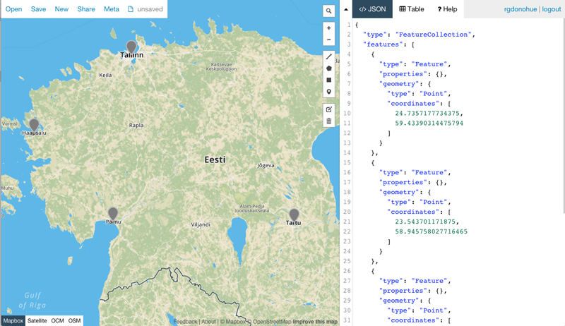  
*Four markers placed on the map using geojson.io.*

Note that as we place these Point features on the map, the JSON is updated in the right side panel, automatically creating a valid GeoJSON representation of these data!

Note that if we click on an existing marker after we place it, a popup window opens, allowing us to add key/value properties (use the add row button) to our marker. In addition to the style properties (i.e., marker-color, marker-size) which you can edit, you add can property names and values. Since we'll be dynamically styling the markers within Leaflet, we need not worry too much about styling these in the editor. We can uncheck **Show style properties** to not see them (though geojson.io retains them in the output GeoJSON code).

This example has added a property "name" with a value of "Tallinn", and a property name "size" with a value of 159 (the area of Tallinn in square kilometers). When we click **Save** these are reflected in the GeoJSON at right (as well as the `marker-color`, etc. properties). Note that geojson.io correctly includes the quotations around the property names, as per the GeoJSON specification.

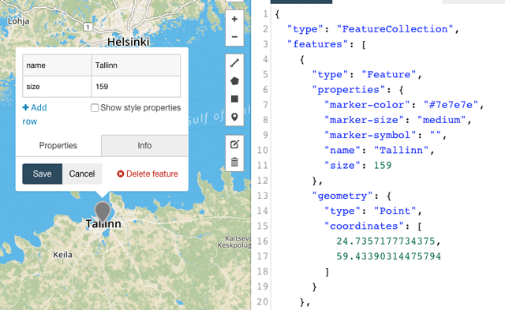  
*Adding properties in geojson.io.*

Go ahead and click on the other markers and give each of them a "name" property with a value (the name of the city), as well as a "size" property with a value of the area (see the GeoJSON pasted below). Feel free to pick other cities in another part of the world for this lesson, if you wish.

### Leaflet's GeoJson Layer

Using geojson.io above, we created a GeoJSON *FeatureCollection*. Now let's get it into our Leaflet map. Eventually, we'll be storing our GeoJSON data in external files and loading them into our script dynamically. Doing so is useful for big data sets, but for now, we can cut and paste the code from the geojson.io web page into our script we're editing in our text editor.

Open *lesson-07/part-i/index.html*. When you paste this code into your *index.html* file (between the `<script><script>` tags, also create a variable (e.g., `places`) and assign the GeoJSON structure to it as its value (see below).  As far as JavaScript is concerned, we've simply created a variable named  `places` and assigned a JavaScript object as its value. JavaScript doesn't know anything about GeoJSON. We need a mapping library to interpret it as such.

```javascript
var places = {
  "type": "FeatureCollection",
  "features": [
    {
      "type": "Feature",
      "properties": {
        "marker-color": "#7e7e7e",
        "marker-size": "medium",
        "marker-symbol": "",
        "name": "Tallinn",
        "size": 159
      },
      "geometry": {
        "type": "Point",
        "coordinates": [
          24.7357177734375,
          59.43390314475794
        ]
      }
    },
    {
      "type": "Feature",
      "properties": {
        "marker-color": "#7e7e7e",
        "marker-size": "medium",
        "marker-symbol": "",
        "name": "Haapsalu",
        "size": 11
      },
      "geometry": {
        "type": "Point",
        "coordinates": [
          23.543701171875,
          58.945758027716465
        ]
      }
    },
    {
      "type": "Feature",
      "properties": {
        "marker-color": "#7e7e7e",
        "marker-size": "medium",
        "marker-symbol": "",
        "name": "Parnu",
        "size": 32
      },
      "geometry": {
        "type": "Point",
        "coordinates": [
          24.510498046875,
          58.38011855064708
        ]
      }
    },
    {
      "type": "Feature",
      "properties": {
        "marker-color": "#7e7e7e",
        "marker-size": "medium",
        "marker-symbol": "",
        "name": "Tartu",
        "size": 39
      },
      "geometry": {
        "type": "Point",
        "coordinates": [
          26.728363037109375,
          58.37147760096145
        ]
      }
    }
  ]
};
```

We created the preceding code within geojson.io, four cities in Estonia. Now pick your own cities with which to experiment and repeat this process.

### Adding points to a map using L.geoJson

Before we can explore the `L.geoJson()` method to add our data to our map, we need to get the basic Leaflet map into our script. We explored the previous lesson (and have been looking at this throughout the course). You can choose whichever tiles you wish for a basemap, but your code should looking something like this (you can write this beneath the `places` variable and GeoJSON object data we just pasted into the script).

```javascript
var map = L.map('map', {
   center: [58.73, 25.67], // centered in Estonia
   zoom: 7
});

var tiles = L.tileLayer('https://cartodb-basemaps-{s}.global.ssl.fastly.net/rastertiles/dark_all/{z}/{x}/{y}.png', {
    attribution: '&copy; <a href="http://www.openstreetmap.org/copyright">OpenStreetMap</a> &copy; <a href="http://cartodb.com/attributions">CartoDB</a>',
    subdomains: 'abcd',
    maxZoom: 19
});  
tiles.addTo(map);
```

Leaflet has its own way of reading **GeoJSON objects** with properties and converting them into a **Leaflet GeoJson layers**. These are different entities, so we'll be mindful of when we're discussing one or the other in the text that follows. This documentation refers to the interchange format as *GeoJSON* and Leaflet's layer as *GeoJson* or *L.GeoJson*). Another distinction to consider is between Leaflet's *feature* and *layer*. Leaflet has two types of layers, 1) base layers like tile layers that we add as base maps and 2) overlays like points, lines, and polygons that exist over base layers. A feature has attributes, e.g., a GeoJSON feature with properties, that can be added to the map as a layer with a custom popup, style, and interactivity. 

First, take a quick review of Leaflet's documentation here: [http://leafletjs.com/reference-#geojson](http://leafletjs.com/reference#geojson). We see that we [create a new Leaflet GeoJson layer](http://leafletjs.com/reference.html#geojson-l.geojson), which represents the GeoJSON object by passing "an object in GeoJSON format" as the first argument and a second optional argument with options.  We see that it "[Extends FeatureGroup](http://leafletjs.com/reference.html#featuregroup)," which is an extended [LayerGroup](http://leafletjs.com/reference.html#layergroup). Extending these groups means that the Leaflet GeoJson object inherits all methods and events of these two groups. A layer group allows us to manage a lot of layers as a single layer so we can toggle them on/off in a legend. A feature group allows us to manage events and popups for each feature. A GeoJson inherits all of these abilities.

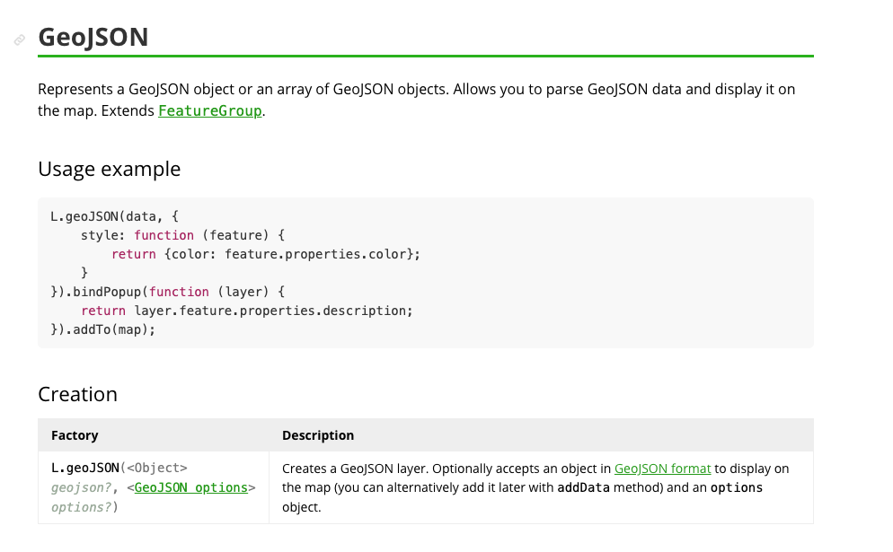  
*Leaflet's API documentation for creating a GeoJson layer.*

Next, below that code creating the basic tiled Leaflet basemap, let's use the Leaflet method to draw and style these GeoJSON points to our map. To do so, we'll use this [Leaflet `L.geoJson()`method](http://leafletjs.com/reference.html#geojson), which parses (i.e., reads and converts into an appropriate format) the GeoJSON data and then creates a GeoJson layer in Leaflet to be displayed on the map.


We'll pass the variable — `places` — with which we're referencing our GeoJSON data as the first argument before adding this new layer to the map using Leaflet's `addTo(map)` method. We can do this with a single statement, and assign that return object a Leaflet *GeoJson* layer to another variable (`placesLeaflet`) to access later on:

```javascript
var placesLeaflet = L.geoJson(places).addTo(map);
```

Leaflet's `L.geoJson()` method has parsed that data structure and (by default) converted it to a Leaflet GeoJson layer and drawn those GeoJSON Point Features as Leaflet markers. The `.addTo()` method, of course, adds this layer to the map. That's powerful for a short line of code!

We can refresh our browser, and we're looking at our old friends: the Leaflet markers! Notice how Leaflet doesn't interpret those marker styles that geojson.io placed within the GeoJSON.

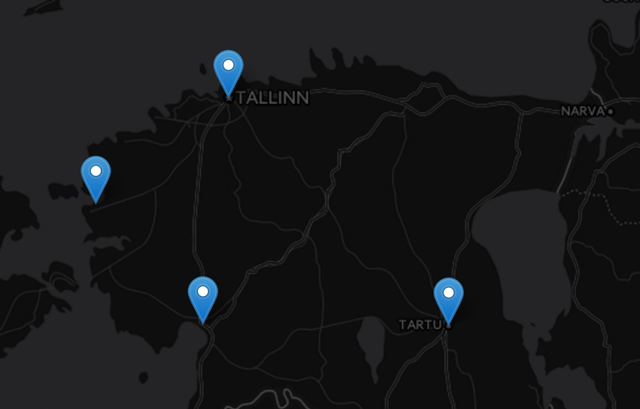  
*Four leaflet markers drawn from GeoJSON point features.*

It's worth comparing a `console.log(places)` statement with a `console.log(placesLeaflet)` statement at this point to begin unraveling what Leaflet's doing with the GeoJSON data that we provide it. If we drill down a bit into our console, we recognize the GeoJSON structure we've built in geojson.io and then assigned to `places`. The output for `console.log(placesLeaflet)` reveals that the `L.geoJson()` method has converted the GeoJSON data into a Leaflet object (a.k.a. Leaflet "layer"), which means there are Leaflet options, events, and methods now available to this object for use within our map.

  
*Console log comparing the difference between GeoJSON and GeoJson (Leaflet object)*

The complicated structure of the `placesLeaflet` variable is harder to grasp immediately than the more simple GeoJSON data structure, but we'll learn which of these property names are necessary for understanding.

#### Using the pointToLayer option for L.GeoJson

Okay, we're getting tired of those same old markers, right? Let's move on to draw these points as [Leaflet circles](http://leafletjs.com/reference.html#circle) instead.  To do so, let's have a look at the options available to use when we invoke this `L.geoJson()` method (again, study the API Reference: [http://leafletjs.com/reference.html#geojson](http://leafletjs.com/reference.html#geojson)).

The first option available to us is `pointToLayer`, which Leaflet tells us is "used for creating layers for GeoJSON points (if not specified, simple markers will be created)."  The method accepts two parameters, the GeoJSON `featureData` and a `LatLng` object.

From where do these two parameters come? The `pointToLayer` function is an anonymous function, not called from anywhere else in the script. We pass these values implicitly (i.e., "behind the scenes" or "under the hood") within the inner workings of the `L.geoJson()` method. For every Point type feature in our GeoJSON data, the `L.geoJson()` method passes that feature's data and its coordinates to the `pointToLayer`'s associated function.

Once again, we'll use the `console.log()` statement to help us better understand how this code is operating.

```javascript
var placesLeaflet = L.geoJson(places, {
    pointToLayer : function(feature, latlng) {
        console.log(feature, latlng);
        return L.circle(latlng, 20000);
    }
}).addTo(map);
```

Saving that code and testing in our browser reveal that we've drawn the markers as Leaflet circle objects:

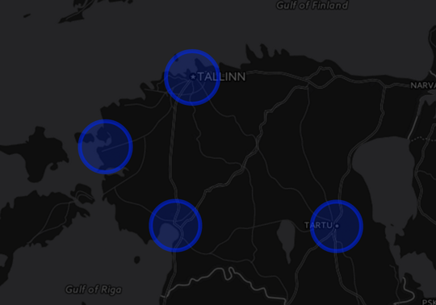  
*The circles drawn from GeoJSON point features.*

Now let's look carefully at that Console output. Notice how with the JavaScript we can access the nested properties of the GeoJSON data within the Leaflet methods:

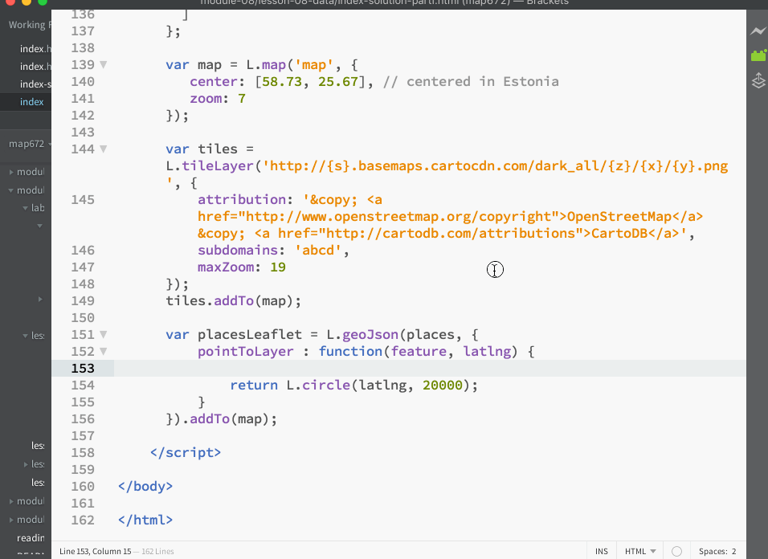  
*Accessing properties within GeoJSON data*

Note that the `feature` and `latlng` are not defined persistently within this script, nor are they required words. They are in fact parameters of that function, so we can name them whatever we wish. For example `f` and `ll` work just as well:

```javascript
var placesLeaflet =  L.geoJson(places, {
    pointToLayer : function(f, ll) {
        console.log(f,ll);
        return L.circle(ll, 20000);
    }
}).addTo(map);
```

The return statement is critical here, returning the Leaflet `L.circle` object we've created (we just hard-coded a value of 20000 meters for`L.circle`'s second required argument, which encodes the radius of the circle in meters). But of course, we could have altered that radius size based on other data in the GeoJSON (as we'll do it a bit).  That `L.circle` layer, for now, is drawn to the map by the `L.geoJson()` method.

It's okay if all this seems a little murky. Again, the reason we're using Leaflet is that it's running a bunch of code we don't need to (or want to!) wrestle with or need to understand fully. The important thing here is that we pass a GeoJSON FeatureCollection as the first argument and can use the `pointToLayer` option to convert Point features from the default Leaflet markers to Leaflet circles objects.

#### Using L.geoJson to access properties data

Now for something really important. We're using the latitude and longitude values for each point to place the Leaflet circles on the map. But why is that `pointToLayer` function also accessing each feature data as well? The answer is that we often wish to access data held within the properties of a GeoJSON feature.

Let's revisit that example again, and this time let's log to Console that feature parameter within the `pointToLayer` callback function and inspect it in the browser:

```javascript
var placesLeaflet = L.geoJson(places, {
    pointToLayer : function(feature, latlng) {
        console.log(feature);
        return L.circle(latlng, 20000);
    }
}).addTo(map);
```

When we examine that feature logged to the Console, we see we have a way to access our attribute data stored within each layer's properties. Again, as we learned in previous modules, we can access sub-properties of an object using dot notation.

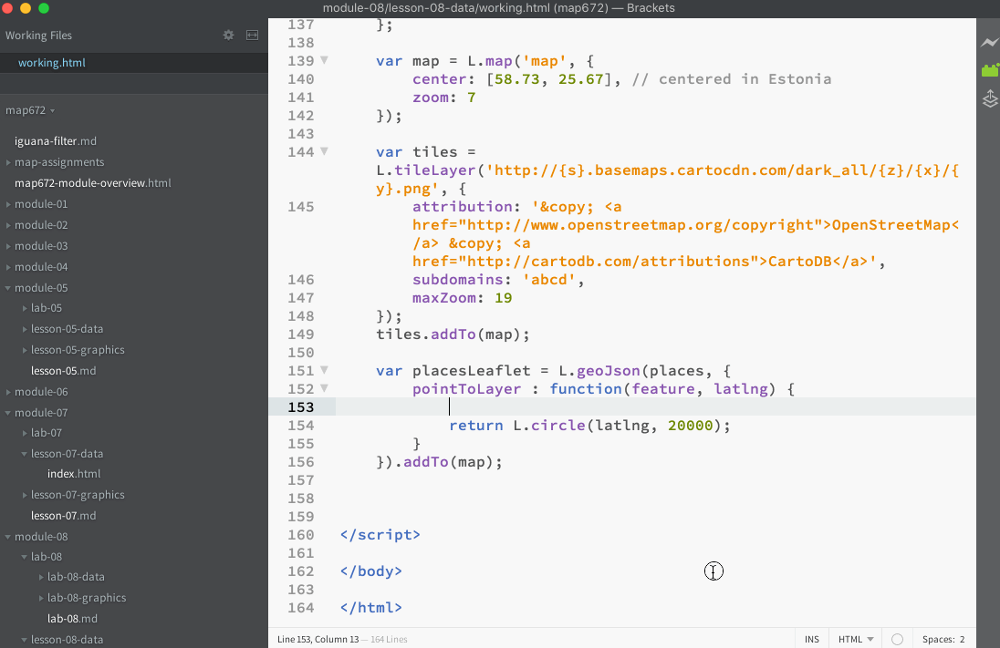  
*Inspecting the feature properties of each layer object.* 

In other words, within our JavaScript, we can write `feature.properties.size` to access the value of that `size` property for each city!

For this example, we encoded each of our four markers with a property named `"size"`. Rather than hard-coding a radius of each circle (e.g., 20000), let's use that feature property within the function to access the value of `"size"` and use it to determine the radius of each circle. BTW, get excited, because we're getting dangerously close to thematic mapping here!

Try the following code, modified from the previous example. Here we're going to multiple the sizes of those cities by 100 so we can see them better across the map.

```javascript
var placesLeaflet = L.geoJson(places, {
    pointToLayer : function(feature, latlng) {
        return L.circle(latlng, feature.properties.size * 100);
    }
}).addTo(map);
```

We can see that instead of hard-coding a numeric value for the second argument of the `L.circle` method, we've accessed the "size" value within the JS objects for each Feature using dot notation, and then used that information to dynamically re-size each circle. The result is evident when we refresh the browser (obviously Tallinn here is much larger than the other cities):

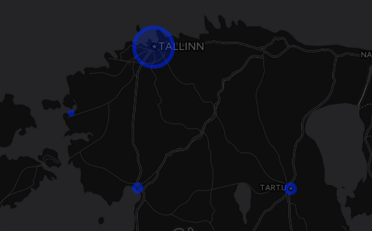  
*Circles with dynamically sized radius*

We'll now move on to storing GeoJSON data in an external file and loading these data into the script.

**ASSIGNMENT: End Part I** At this point we're going to forgo the previously created GeoJSON data of city points. Save a copy of your current *index.html* file as *part-1.html* and commit changes to Git. You'll submit this for **1 pt** of this week's lab grade.

## Part II. Storing and loading GeoJSON data as an external file

Open *lesson-07/part-ii/index.html*. We'll now run through this process again with a larger dataset. You'll also want to set new center coordinates for your map and a zoom level, as we'll be mapping electric power production across the US.

```javascript
 var map = L.map('map', {
    center: [36,-94],
    zoom: 4,
});
```

You'll likely also wish to add a basemap tile layer:

```javascript
var tiles = L.tileLayer('http://{s}.basemaps.cartocdn.com/dark_all/{z}/{x}/{y}.png', {
    attribution: '&copy; <a href="http://www.openstreetmap.org/copyright">OpenStreetMap</a> &copy; <a href="http://cartodb.com/attributions">CartoDB</a>',
    subdomains: 'abcd',
    maxZoom: 19
});  
tiles.addTo(map);
```

Above created GeoJSON data using a neat web tool, [geojson.io](http://geojson.io/). However, often when we're doing thematic mapping, we're working with large data sets of geographic features or events that would be absurdly large to keep in our script. We may store these data in various formats such as ESRI Shapefiles, Excel spreadsheets, Comma Separated Values (CSV) files, and databases. We also store these data as GeoJSON, which as we have already seen, is simply plain-text JavaScript object notation (JSON).

Rather than pasting such a large structure within our JavaScript code, however, it is better to store these as external files, either as *filename.json* or as *filename.js*.

 For this lesson, we'll be using a pre-built GeoJSON data structure stored in a file named *power-plants.js* (included within your *lesson-07/data/* directory). The data are 6900 electrical generating power plants across the US obtained from the {EIA's form 923](http://www.eia.gov/electricity/data/eia923/). The data contain the total generating capacity of each plant, as well its fuel source(s), encoded as one or more of the following string values:

>"Hydro", "Coal", "Natural Gas", "Petroleum", "Nuclear", "Wind", "Pumped Storage", "Solar", "Geothermal", "Biomass", "Wood", "Other", or "Other Fossil Gasses."

The data also contain the capacity generated from up two sources if applicable (e.g., some power plants may use both coal and natural gas) and about 500 of the 6900 plants generate power from two primary sources. Note: the data for any plant includes no more than two fuel sources.

Open up the file in your text editor. We can see a mess of a GeoJSON structure, which is intelligible to read.  Take a look through it and acquaint yourself with the various properties and values. It is good practice as these are they keys that allow us to access the data in our script.

`var plants = {"type":"FeatureCollection","features":[{"type":"Feature","properties":{"code":2,"plant_name":"Bankhead Dam","capacity_mw":56,"fuel_source":{"Hydro":56}},"geometry":{"type":"Point","coordinates":[-87.35682,33.45867]}},{"type":"Feature","properties":{"code":3,"plant_name":"Barry","capacity_mw":2574.5,"fuel_source":{"Coal":1612.5,"Natural Gas":962}},"geometry":{"type":"Point","coordinates":[-88.0103,31.0069]}},{"type":"Feature","properties":{"code":4,"plant_name":"Walter Bouldin Dam","capacity_mw":225.9,"fuel_source":{"Hydro":225.9}},"geometry":{"type":"Point","coordinates":[-86.28306,32.58389]}}`

To better understand how to access these data within our script, it may be useful to visualize the GeoJSON as its nested structure with nicely indented formatting:

```javascript
var plants = {
    "type":"FeatureCollection",
    "features":[
        {
            "type":"Feature",
            "properties":{
                "code":2,
                "plant_name":"Bankhead Dam",
                "capacity_mw":56,
                "fuel_source":{
                    "Hydro":56
                }
            },
            "geometry":{
                "type":"Point",
                "coordinates":[-87.35682,33.45867]
            }
        },{
            "type":"Feature",
            "properties":{
                "code":3,
                "plant_name":"Barry",
                "capacity_mw":2574.5,
                "fuel_source":{
                    "Coal":1612.5,
                    "Natural Gas":962
                }
            },
            "geometry":{
                "type":"Point",
                "coordinates":[-88.0103,31.0069]
            }
        },{
            "type":"Feature",
            "properties":{
                "code":4,
                "plant_name":"Walter Bouldin Dam",
                "capacity_mw":225.9,
                "fuel_source":{
                    "Hydro":225.9
                }
            },
            "geometry":{
                "type":"Point",
                "coordinates":[-86.28306,32.58389]
            }
        }
    } // ... GeoJSON continues
```

Note that within this file we've assigned the GeoJSON object to a JavaScript variable named `plants` (similar to how we assigned our Estonian cities GeoJSON to a variable named `places` above). Once we load this script into the DOM, we can access the plant name of the first power plant using dot or bracket notation, like so: `plants.features[0].properties.plant_name`.

Also take a look at how we've stored the fuel sources for the power plants as an object as well. So, to access the value of the electricity generated from burning coal at the Barry power plant, we'd use this: `plants.features[1].properties.fuel_source["Coal"]`.  We're using the brackets with the property name in quotations here because some of our property names contain spaces (e.g., `"Natural Gas"`) and **therefore, the dot notation syntax would not work for these names**. And we want to build code that doesn't fail and unexpected times, so even though we could get away with dot notation in some cases (such as coal) we'll use this other notation to keep things working across the board.

Now that we've acquainted ourselves with the data structure of this GeoJSON, let's get it into our script and start cooking with gas (or hydropower as the case may be)!

### Loading an external file .JS file with GeoJSON into our JavaScript

There are two ways we get the GeoJSON into our script. One way is to use AJAX (Asynchronous JavaScript and XML), which dynamically loads the data, stored as *filename.json*,  into the script. We'll explore various AJAX techniques in MAP673.

A simpler way — and what we'll be doing here — is to simply save the GeoJSON structure in a file, saved as *filename.js*, and assign it to a variable within that file.

For this lab we've saved the data as a JavaScript file, using the `.js` as the file extension, and assigned the GeoJSON structure to a variable within that file `plants` (**important: the `plants` variable within the script has been declared and assigned within this file, not within the rest of our JavaScript**).

Recall how we're already loading the Leaflet JavaScript into our web page by using the HTML `<script>` element. Although we've been mostly focused on JavaScript the past couple of weeks, remember that your web map *index.html* file also has HTML and CSS we should pay attention to. The HTML `<script>` element is used to embed or reference an executable script within our HTML document, e.g., `<script src="https://unpkg.com/leaflet@1.6.0/dist/leaflet.js"></script>`.

We can also use the HTML `<script>` element to load our GeoJSON data stored as a "local" file within *power-plants.js*. Just above the point where we begin writing our custom JavaScript code (toward the bottom of our document), we can simply write `<script src="power-plants.js"></script>` (provided there is a *power-plants.js* file in the same directory as the *index.html* file given the relative path we've provided).

```html
<script src="https://unpkg.com/leaflet@1.6.0/dist/leaflet.js"></script>
<script src="power-plants.js"></script>
<script>
    // custom JavaScript here
</script>
```

It is critical that the data is loaded in some way above our custom JS code where we start using that variable `plants`. If our script is looking for a variable named `plants`, then that variable must already exist!

We can verify that `plants` is accessible with a friendly old `console.log(plants)` statement. Examining the output reveals that our GeoJSON structure is still intact and now accessible within the HTML document:

  
*Console output of the `plants` variable.*

### Drawing our GeoJSON data to the map

For our first step, let's use Leaflet's `L.geoJson()` method to draw these data to our map. If we simply execute the statement `L.geoJson(plants).addTo(map);` … wait for it (hopefully, your machine doesn't crash) … voila! You've drawn 6900 Leaflet markers to the map!

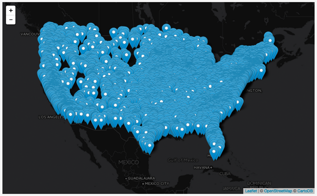  
*6900 Leaflet markers on the map from an external GeoJSON file.*

It's currently neither the most attractive nor the most effective map.

Let's replace those marker icons and draw an SVG circle instead. Like our simple example with the Estonian cities above, we're going to use that option belonging to `L.geoJSON()`called `pointToLayer`. The basic code to do this looks like this:

```javascript
L.geoJson(plants, {
    pointToLayer: function(feature, latlng) {
        // future code goes here
    }
}).addTo(map);
```

We've used Leaflet's [*Circle*](http://leafletjs.com/reference.html#circle) class to generate "a circle object given a geographical point, a radius in meters and optionally an options object." This Circle class is useful for drawing circles to depict real-world distances, such as a walking radius.

However, we're now going to make use of another Leaflet class [*CircleMarker*](http://leafletjs.com/reference.html#circlemarker), which extends the Leaflet *Circle* with  `setLatLng()` and `setRadius()` methods.

Unlike the *Circle* object, the radii of Leaflet's *CircleMarker* objects are stored in pixels (on your display screen), not meters, which provides us some useful design options. Furthermore,  as we can read within the API Reference, the radius is **not** passed as a required argument when we instantiate the *CircleMarker* (like we do with the *Circle* object, e.g., `L.circle([36,-94],400).addTo(map);`. Instead, we set the radius either set after the fact using that `setRadius()` method or through inclusion of the radius option in the path options.

Let's then turn those Leaflet markers into Leaflet *CircleMarkers*, at first passing no options in the optional second argument. Of course, we still need to pass the `latlng`. Otherwise the circle marker has no location.

```javascript
L.geoJson(plants, {
    pointToLayer: function(feature,latlng) {
            return L.circleMarker(latlng);   
    }
}).addTo(map);
```

The result is some SVG circles drawn to the map using Leaflet's default options including a default radius of 10 pixels for each circle size. Remember, Leaflet's *Circle* and *CircleMarker* classes extend (or add functionality to) the *Path* class, so you'll want to consult those options ([Leaflet path options](http://leafletjs.com/reference.html#path)) to consider the ways you can style these differently.

  
*Leaflet CircleMarkers drawn to the map with default options*

Still not the greatest map, but this is useful in showing the difference between *Circle* and *CircleMarker*. Notice that when you zoom into the map, the circles remain their given size due to their radii being drawn in pixel units instead of meters. If we used *Circle* instead (and set the radii) the circles would appear larger as we zoomed in closer.

  
*CircleMarkers remain the same size as we zoom*

Let's now define a few options for these circles. To include these options, we add a second argument to the `L.circleMarker()` call. This argument will be a JavaScript object (i.e., beginning and ending with curly braces and containing name/value pairs). Compare this carefully with the preceding code block:

```javascript
L.geoJson(plants, {
    pointToLayer: function(feature,latlng) {
            return L.circleMarker(latlng, {
                // options go here
            });   
    }
}).addTo(map);
```

Since we're dealing with electric power, let's use a color more connotative of electricity, such as orange for the circle's stroke and yellow for the fill color. Furthermore, we'll raise the default stroke weight and the fillOpacity value to 1. Finally, let's reduce the default radius size to 2 pixels.

```javascript
    return L.circleMarker(latlng, {
         color: 'orange',
         weight: 1,
         fillColor: 'yellow',
         fillOpacity: 1,
         radius: 2
     });
```
The result is a map showing the general spatial pattern of US electric power production:

  
*CircleMarkers with custom, orange-yellow options.*

Of course, this simple map — with every power plant symbolized the same way — hides as much as it reveals so we want to start thinking about what we can do to make it more informative. For instance, what happens when we begin to filter these plants by their respective fuel source?

### Filtering GeoJSON Features

Currently, there are many symbols on the map, which may make it a bit hard to read. One way to reduce this visual complexity is to show less of the data. There are lots of ways to filter the data, and as map developers, we need to think about this both regarding the data itself and what we want the map to say. Once we decide which meaningful slices of data we want to show, we can start implementing the solution with the code.

One approach is to filter the SVG circles when we create Leaflet's *GeoJson* layer. We can filter our data before we create the *GeoJson* layer using the `L.geoJson()` method's `filter` option ([http://leafletjs.com/reference.html#geojson-filter](http://leafletjs.com/reference.html#geojson-filter)), which calls a function on each feature when we create the Leaflet *GeoJson* layer. Accessing the original GeoJSON data within the `filter` method through the parameter `feature` works just as it did within the `pointToLayer` method.

By applying some conditional logic, we can have the code only create layers that meet certain conditions.

```javascript
pointToLayer: function(feature,latlng) {
        return L.circleMarker(latlng, {
            color: 'orange',
            weight: 1,
            fillColor: 'yellow',
            fillOpacity: .8,
            radius: 2
        });   
},
filter: function(feature, layer) {
    if(/* some expression here */){
        return feature;  // return that feature to be included in the layer group
    }
}
```

Let's say we wish to filter the map to see only the power plants that are generated using Hydropower. Remember that within our original GeoJSON data, we've encoded the power produced from various fuel sources, and the property name for hydropower is  "Hydro". Therefore, we can use a conditional statement `if(feature.properties.fuel_source.Hydro)` to see if each layer uses "Hydro" as its source. If so, we can return that feature.

```javascript
L.geoJson(plants, {
    pointToLayer: function(feature,latlng) {
            return L.circleMarker(latlng, {
                color: 'darkblue',
                weight: 1,
                fillColor: 'sky-blue',
                fillOpacity: .8,
                radius: 2
            });   
    },
    filter: function(feature, layer) {
        if(feature.properties.fuel_source.Hydro){
            return feature;   
        }
    }
});
```

Note that we also gave the hydroplants a different color, such as blue (associated with water?).

The result shows us the spatial distribution of hydroelectric power generation in the US, and we can see the prevalence of hydropower in the Pacific Northwest as well as the large dam projects sponsored by the TVA in the 40s.

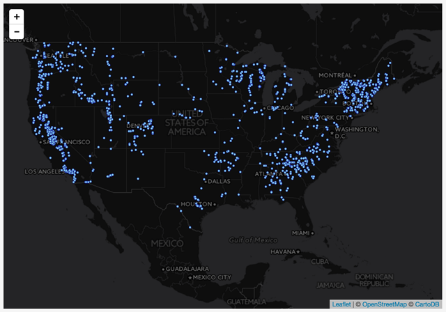  
*Filtered map to just show hydropower*

We can now easily modify the script to show another fuel source, such as "Wind" (`feature.properties.fuel_source.Wind`), which differs substantially from that of hydropower.

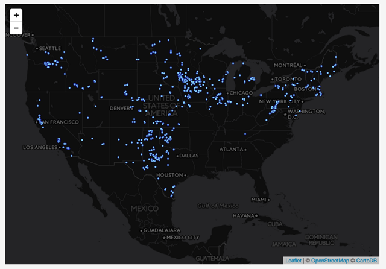  
*Filtered map to just show wind power*

What about showing all the "Natural Gas" plants? Recall when we learned about accessing object properties that sometimes we needed to use the bracket syntax and not the dot syntax? Because "Natural Gas" has that space in it, in this case we need to use the bracket syntax. We can filter by writing: `feature.properties.fuel_source['Natural Gas']` (and perhaps color those CircleMarkers orange?).

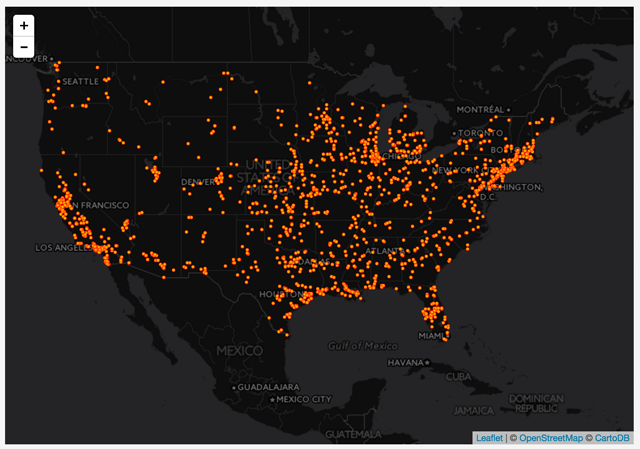  
*Filtered map to just show natural gas power.*

We could also filter these data by another data attribute, such as by the amount of their installed capacity, encoded within the data property of "capacity_mw". This example filters to show only the power plants producing more than 500MW hours:

```javascript
filter : function(feature, layer) {
    if(feature.properties.capacity_mw > 500){
        return feature;   
    }
}
```
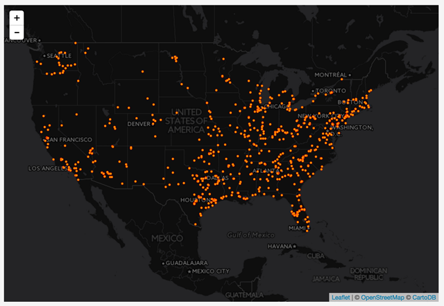  
*US power generation filtered to show plants producing more than 500MW.*

We can also use variations on the expression — using the `&&` operator — to filter our features on multiple sets of criteria, such as coal power plants producing less than 500 MW of power:

```javascript
filter : function(feature, layer) {
    if(feature.properties.capacity_mw < 500 &&
        feature.properties.fuel_source.Coal){
        return feature;   
    }
}
```

We applied both conditions and returned only those features to become Leaflet layers:

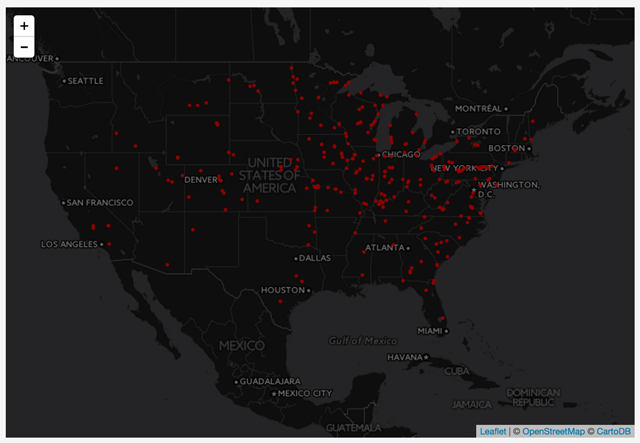  
*US power generation is filtered to show coal plants producing less than 500MW.*

We can also use an SVG as an icon for these plants. First we'll create a Leaflet icon object with the `iconUrl` option set to the path of the SVG image we'll use for an icon.

```javascript
var plantIcon = L.icon({
  iconUrl: 'images/noun_2071.svg',
  iconSize: [40, 40]
});
L.geoJson(plants, { ... code here ... });
```

Then we can change our code to return a Leaflet marker, using our icon:

```javascript
pointToLayer: function(feature,latlng) {
    return L.marker(latlng, {
        icon: plantIcon
    });
}
```

The result may be a little cluttered at smaller cartographic scales, but looks good when zoomed in.

Note: this icon was downloaded from the [Noun Project](https://thenounproject.com/) and edited with a fill color. See [noun_2071.svg](images/noun_2071.svg)

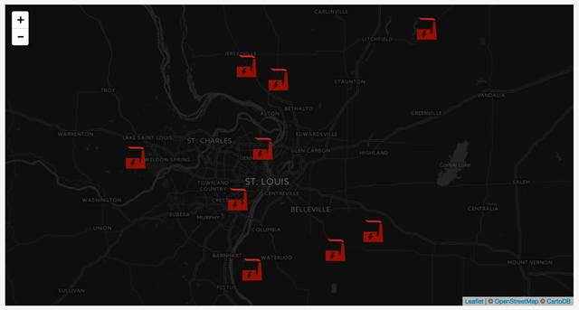  
*US power generation is filtered to show coal plants producing less than 500MW and symbolized with an SVG icon.*

We can even create two different icons for different power source types, and apply some conditional logic to parse them before creating the marker.

First, create two (or more) Leaflet icons (or replace the previous `plantIcon` object), with the correct path to the image used as the `iconUrl` value:

```javascript
var coalIcon = L.icon({
  iconUrl: 'images/noun_2071.svg',
  iconSize: [30, 30]
});

var windIcon = L.icon({
    iconUrl: 'images/noun_2076.svg',
    iconSize: [30, 30]
});
L.geoJson(plants, { ... });
```

Then, within the `pointToLayer` function, use conditional logic to determine if each layer is either wind or coal.


```javascript
pointToLayer: function(feature,latlng) {

    if(feature.properties.fuel_source.Wind){
        var icon = windIcon;
    } else if(feature.properties.fuel_source.Coal){
        var icon = coalIcon;
    }

    return L.marker(latlng, {
        icon: icon
    });
}
```

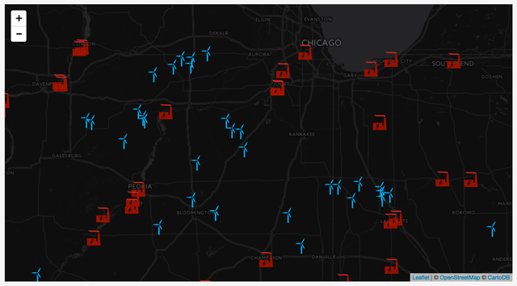  
*US power generation is filtered to show coal plants and wind plants, symbolized with SVG icons.*

With these examples we begin to see how we can programmatically filter and symbolize large data sets drawn from external sources.

**ASSIGNMENT: End Part II:** Save your work accomplished through part II of this this lesson and **submit for 3 pts of this week's lab grade**.

Next up! We'll [move on to the lab](lab-07/) to develop a thematic proportional symbol map using Leaflet.
